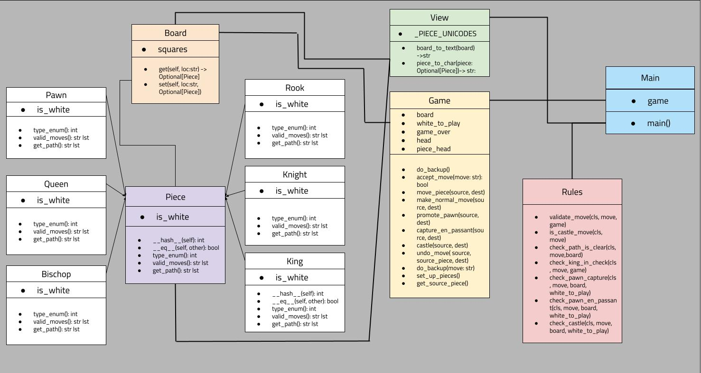
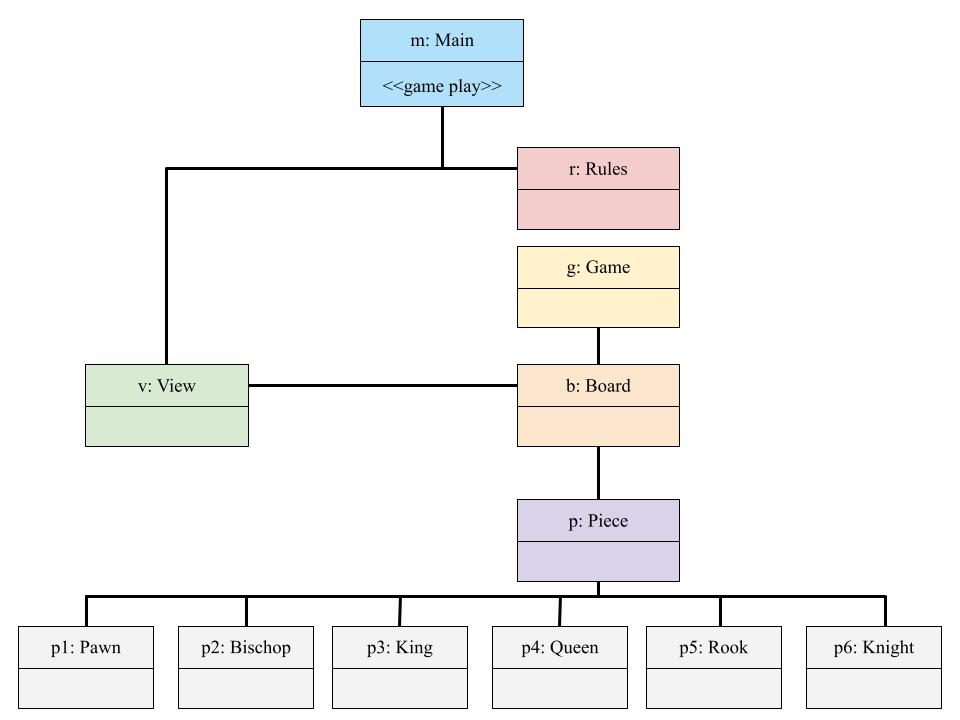
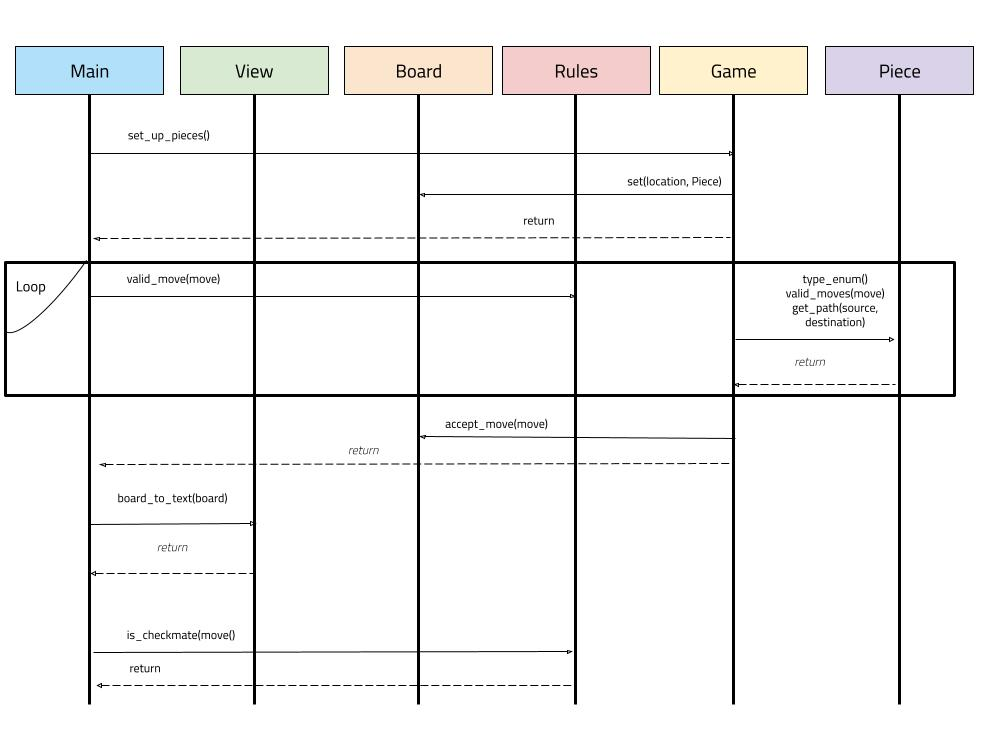

# Design

This project implements a basic version of chess in Python through terminal 
 ASCII art. We used object-oriented programming design principles, Agile sprints, 
 and various testing procedures to deliver our current version. 

## Introduction

Chess is a strategic board game that has been played for centuries and is 
 enjoyed by millions of people worldwide. The game is played on a square board 
 divided into 64 squares, with each player starting with sixteen pieces 
 consisting of one king, one queen, two rooks, two knights, two bishops, 
 and eight pawns.

The objective of chess is to checkmate the opponent's king, which means trapping 
 the king so that it is in a position to be captured (i.e., in check) and there 
 is no legal move that can be made to avoid capture. Players take turns moving 
 their pieces, with each piece having its unique set of rules for movement and 
 capture.

The king is the most important piece on the board, and its capture results in 
 the game's end. The queen is the most powerful piece, able to move in any 
 direction along a straight line or diagonally. The rooks move along straight 
 lines, while bishops move diagonally. Knights move in an L-shape, two squares 
 in one direction and then one square at a right angle.

Pawns are the least powerful piece, but they can be promoted to any other piece 
 if they reach the opposite end of the board. Pawns can move forward one or two 
 squares on their first move and then one square forward on subsequent moves. 
 They capture diagonally one square forward.

Chess is a game of strategy and foresight, where each player must anticipate 
 their opponent's moves and plan their own moves accordingly. Chess is also 
 a zero-sum game, which means that out of both players, only one player can win. 
 With intricate movement rules and interesting game plays, Chess is one of the 
 most challenging games to play (and implement).  

### Goals

The overall goal is to implement a basic version of chess. More specifically, 
 the following are the goals of this project:

* Providing initial movement checks (moving a non-existent piece and moving an 
 opponent piece)
* Providing errors in the terminal for illegal pawn, bischop, knight, rook, king, 
and queen moves
* Preventing current player from making a move that checks their own king
* Support castling and errors for castling conditions that are not met
* Allow backup moves
* Allow game to end when a king is checked

### Non-goals
This project creates a basic game of chess. Some more advanced features of chess
 are not supported. Examples include:

* Supporting game timing
* Support chess piece promotions
* Allow draws and resignations

## Design
Following the best practices of object-oriented programming, we want to design 
 the system to reduce coupling. Our game is split into four main parts: the
 user interface module, the rules module, the chess model module, and a 
 game play module. The user interface module describes how the chess board and 
 pieces are displayed. The chess model module should implement the logic for 
 each piece and general chessgame logic (e.g. moving the pieces, detecting 
 illegal moves, etc.). The game play module integrates the aforementioned 
 two modules: everytime the chess model updates the state of the game, it 
 should be reflected in the user interface. 

### User Interface Module
The board is a two-dimensional square represented by two axis. The x-axis is 
 labeled from a-h where a is the leftmost square and h is the rightmost square. 
 The y-axis should be labeled from 1-8 where 1 is the bottom-most square and 8
 is the top-most square. Each chess piece should be represented by their proper
 unicode character and an empty position should be shown by a neutral character
 (e.g. a dot, dash, etc.). Pieces should also be colored to display which piece
 belongs to which player. 

### Rules Module
The Rules module ensures that all the necessary checks are met before 
 making a respective move in the game (which is then reflected in the board). 
 These rules are common checks, such as ensuring that source pieces exist, pieces
 don't override the same color pieces, etc. This allows us to separate the rules 
 of the game from the actual game state. Moreover, this provides us flexibility 
 in adding additional checks and functionalities without having to refactor
 code in any of the other models. Therefore, changes to rules are contained
 within the rules module. 

### Chess Model Module
The chess model module has two main functions: describe the behaviors of chess 
 pieces and describe and enforce game logic. This design reduces the cohesion as
 game pieces don't have to manage the overhead of game state due to game logic,
 and the game logic doesn't have to know the behaviors of the game pieces. This
 means that chess piece logic can be updated without needing to update game logic,
 and game logic can be updated without needing to update chess piece logic. The 
 single point of contact is relationship between each piece and the game, 
 which is the piece's location. 

#### Chess Pieces
The chess pieces module describes the behavior for each piece. We will first 
 have a parent piece class that initializes the piece's color, defines the equal
 and hash function, returns an id/type/enum, a collection of valid moves for 
 the piece, and the path movement for the piece given a source and a destination
 location. Each chess piece will be a child of this parent piece class, and will
 implement it's type/enum, valid moves, and path movement depending on that 
 piece's rules.  

#### Chess Model
The chess model module carries the movement logic for the entire chess game. The
 general movement rule should be to check that the piece's destination is valid
 and the path to the destination is valid before accepting the move and 
 reflecting the movement on the board (from the Check module). Moreover, for 
 special movements like en passant and castling, it is useful to know the state
 of the board and other respective pieces to decide when and where to move. 
 Thus, in the case of movements that require additional state checking, those
 movements will be checked and done in the chess model.  

### Game Play Module
The game play module integrates the chess model and chess pieces with the user 
 interface. The game play module should first check if there are any errors 
 coming from the Rules module. If so, it should prompt the user that the inputted
 move is invalid until the user enters a move that's valid according to the chess
 model's logic. When this does occur, the system should exit prompting for a 
 proper move, and should ask the move for the next player. 

## Implementation
The implementation of chess in Python will be done through classes. Each class
 represents a separation of concern and will have a sole focus. The three 
 aforementioned modules in the Design will be represented by Python classes. 

### User Interface Module
The user interface module is view.py. In the view class, there is a dictionary 
 mapping the pieces (represented as strings) to the respective unicode 
 representation (depending on if the color of the piece is white or not). An 
 empty space is represented by a dot (unicode \u00B7). There will also be a 
 function that takes a given board and returns a text representation 
 (board_to_text). This will help us to print the board in the terminal. Finally, 
 a piece_to_char function will return the respective unicode representation of 
 a piece. This is helpful for debugging in the terminal. 

### Rules Module
The Rules module does the general checking before accepting the move in the Game
 class. Rules such as checking if source piece is valid, checking if source 
 piece is the right color, checking that input matches the intended form, 
 checking if dest piece is the same color are some common checks that can be done
 each time in the beginning of each move. 

### Chess Model Module
The chess model module has two components: chess pieces and game logic. 

#### Chess Pieces
In accordance with the design of the chess pieces, there are several classes 
 that represent the chess pieces: a parent Piece class, and a child Pawn, Bischop,
 Rook, Queen, Knight, and King. In the parent Piece class, the __init__ function
 sets the piece's color through the is_white boolean parameter. The hash function
 combines the type of the Piece and the is_white value to pass in Python's
 default hash function. The __eq__ function then uses the new hash function to 
 test object equality. The function type_enum returns 0 (as a default value for
 the parent class). Similarly, the valid_moves and get_path function returns an 
 empty list as a default value. The child pieces -- Pawn, 
 Bischop, Rook, Queen, Knight, and King -- returns a specific int identifier 
 (1,2,3,4,5,6 respectively) for each type of piece (this offers a quicker 
 method to determine the type of the piece without accessing the name of the 
 class). All pieces use the default __hash__ and __eq__ functions from their
 parent class. However, each class implements their own valid_moves and get_path
 respectively. This logic can be found in model.py. 

#### Chess Model
The chess model logic is also in model.py. This class begins with a Board class,
 which represents a board as a dictionary mapping string positons (e.g. 
 'a4') to pieces. The Board class has a gettter that given a location returns
 an optional piece (None or a Piece object). It also has a setter, which given
 a location sets the piece to that location. 

 The chess model also has a Game class. In the game class, there is a Board, a 
  boolean flag white_to_play (determinign whose turn it is), a boolean game_over
  flag, and two pointers to help with determining the past states of the game. 
  This model implements the logic of chess.  If a given move is valid (from the
  Rules module), it then makes the move and updates the board to reflect the new
  state. 

### Game Play Module
The game play module integrates everything together. While the game is still 
 running, that is, the game_over has not been set, the system prompts the user 
 for a valid move. Then it goes into the Rules module to check that the command
 is valid and that the move is valid. If there exists any error, it will 
 prompt the user to re-enter a valid command until it the Rules module detects
 that the logic is correct. 

## Testing
The testing is primarily done through unit tests. These unit tests test that
 invalid moves aren't allowed and valid moves happen in addition to input 
 validation of the commands. Game play is also tested functionally through manual
 inputs to ensure that entire game plays can occur. 

## Future Work
Future work would make the game more chess like. Examples can include adding
 a timed game, playing against an AI, and other tournament-style features. 
